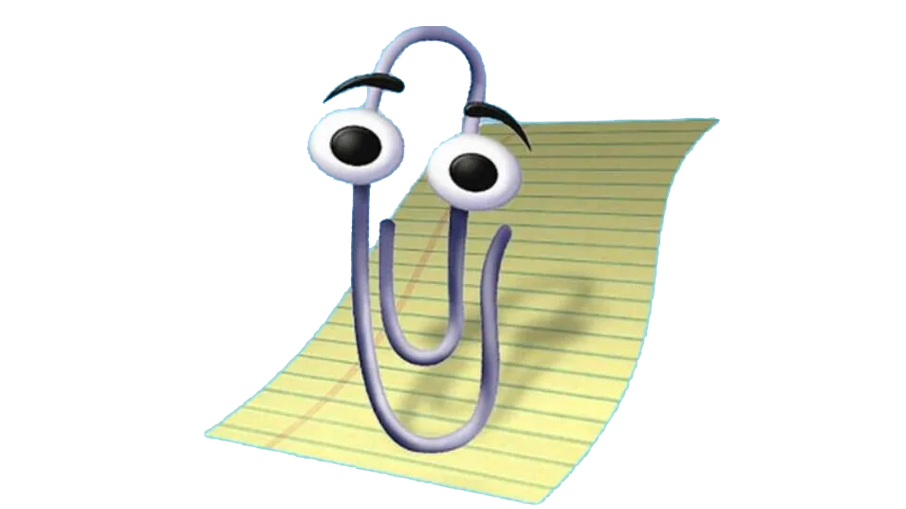

# [AutoGen](https://www.youtube.com/watch?v=kj8nVBI_oiM) Studio for windows

<p align="center">
  
</p>

**[microsoft/autogen](https://github.com/microsoft/autogen)** **[Doc](https://github.com/microsoft/autogen/tree/main/samples/apps/autogen-studio)**

AutoGen Studio is an AutoGen-powered AI app (user interface) to help you rapidly prototype AI agents, enhance them with skills, compose them into workflows and interact with them to accomplish tasks. It is built on top of the AutoGen framework, which is a toolkit for building AI agents.

- [Install Miniconda](https://docs.anaconda.com/free/miniconda/)
- Download and Unzip This Repo.
- Inside all .Bat Files You will need to change yourusername

```
call C:\Users\myusername\miniconda3\Scripts\activate.bat base
```
- Run [Install.bat](https://github.com/hqnicolas/WindowsAutoGenStudio/blob/main/install.bat)
- Make Sure [Your Ollama Server](https://github.com/hqnicolas/OllamaDockerCasaOs) is Runing
- Inside Models and Agents .Json files, You will need to change [Ollama Server](https://github.com/hqnicolas/OllamaDockerCasaOs) URL:

```
"base_url":"http://10.1.1.1/v1"
```
```
"base_url":"https://server.ollama.ia/v1"
```

- Run [start.bat](https://github.com/hqnicolas/WindowsAutoGenStudio/blob/main/start.bat)
- Add Model files to WebUi


